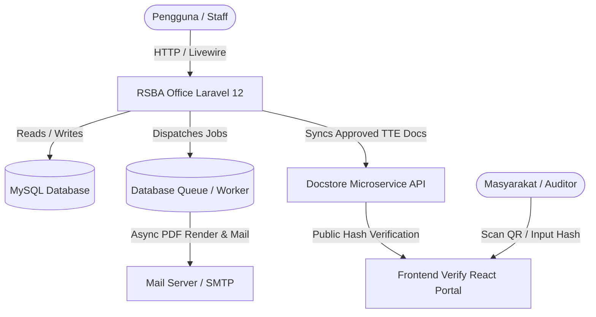

# 🏥 RSBA OFFICE — Sistem Informasi Manajemen SDM & Perkantoran Terpadu

<p align="center">
  
</p>

<p align="center">
  <b>Portal Resmi Manajemen Kepegawaian, Penjadwalan Ruangan, Presensi, Payroll, & Digital Signature TTE</b><br>
  <i>Rumah Sakit Bintang Amin (RSBA) Lampung</i>
</p>

<p align="center">
  
  
  
  
  
  
  
</p>

---

## 📑 Daftar Isi

- [Ikhtisar Sistem](#-ikhtisar-sistem)
- [Teknologi & Dependensi Utama](#-teknologi--dependensi-utama)
- [Fitur Utama & Modul Aplikasi](#-fitur-utama--modul-aplikasi)
  - [1. Modul Jadwal Kerja & Shift Ruangan](#1-modul-jadwal-kerja--shift-ruangan)
  - [2. Modul Presensi & Clearing Raw Punch](#2-modul-presensi--clearing-raw-punch)
  - [3. Modul Cuti Bersama & Izin Karyawan](#3-modul-cuti-bersama--izin-karyawan)
  - [4. Modul Penggajian (Payroll) & Pajak PPh 21 TER](#4-modul-penggajian-payroll--pajak-pph-21-ter)
  - [5. Bagan Struktur Organisasi D3.js](#5-bagan-struktur-organisasi-d3js)
  - [6. Otorisasi Spatie Permission (PBAC)](#6-otorisasi-spatie-permission-pbac)
  - [7. Modul Persuratan, Dokumen Digital & QR TTE](#7-modul-persuratan-dokumen-digital--qr-tte)
  - [8. Modul Logistik, Pengadaan & Keuangan](#8-modul-logistik-pengadaan--keuangan)
  - [9. User Experience & Dashboard Modern](#9-user-experience--dashboard-modern)
- [Arsitektur & Pola Rekayasa](#-arsitektur--pola-rekayasa)
- [Langkah Instalasi & Konfigurasi](#-langkah-instalasi--konfigurasi)
- [Perintah CLI Artisan Kustom](#-perintah-cli-artisan-kustom)
- [Akun Default & Hak Akses Pengujian](#-akun-default--hak-akses-pengujian)
- [Lisensi](#-lisensi)

---

## 🏛️ Ikhtisar Sistem

**RSBA Office** adalah aplikasi Enterprise Resource Planning (ERP) perkantoran dan SIM-SDM yang dirancang khusus untuk memenuhi standar tata kelola operasional **Rumah Sakit Bintang Amin**. Sistem ini mengintegrasikan seluruh siklus kepegawaian rumah sakit secara *end-to-end*:
- Penjadwalan dinas per ruangan/instalasi dengan alur persetujuan berjenjang (*multi-tier approval*).
- Rekonsiliasi presensi otomatis dari mesin fingerprint (*raw punch clearing*).
- Simulasi dan integrasi kuota cuti bersama.
- Kalkulasi payroll otomatis terintegrasi Pajak PPh 21 skema TER (Tarif Efektif Rata-Rata) & Pasal 17 UU HPP.
- Pengiriman massal slip gaji terenkripsi ke email via background workers.
- Penerbitan surat dinas resmi ber-Tanda Tangan Elektronik (TTE) kriptografis RSA SHA-256 yang tervalidasi publik via Docstore.

---

## 🛠️ Teknologi & Dependensi Utama

| Komponen | Teknologi / Library | Deskripsi |
| :--- | :--- | :--- |
| **Backend Core** | [Laravel 12](https://laravel.com/) (PHP `^8.2`) | Framework backend MVC & REST API modern |
| **Reactive UI** | [Livewire 4](https://livewire.laravel.com/) | Realtime fullstack reactivity tanpa SPA overhead |
| **UI Components** | [TallStackUI 3](https://tallstackui.com/) | Library komponen TALL stack terpadu |
| **Data Tables** | [Filament Table 5](https://filamentphp.com/) | Advanced datatable filtering, searching, dan paginasi |
| **Styling** | [Tailwind CSS 3](https://tailwindcss.com/) | Utility-first CSS framework |
| **Icons** | [Blade Tabler Icons](https://tabler.io/icons) (`secondnetwork/blade-tabler-icons`) | Vector icon suite modern |
| **PDF Generation** | [Laravel DomPDF](https://github.com/barryvdh/laravel-dompdf) (`barryvdh/laravel-dompdf`) | Engine render dokumen & Slip Gaji PDF |
| **Excel I/O** | [Maatwebsite Excel](https://laravel-excel.com/) (`maatwebsite/excel`) | Export/Import rekap gaji, absensi, & kepegawaian |
| **Authorization** | [Spatie Laravel Permission](https://spatie.be/docs/laravel-permission) (`^6.16`) | Role & Permission-Based Access Control (PBAC) |
| **Kriptografi & TTE** | PHP OpenSSL & PKCS#12 (`.p12`) | Digital Signature RSA SHA-256 & QR Code Validator |
| **WebSocket / Push** | [Laravel Reverb](https://laravel.com/docs/reverb) | Realtime event broadcast & notifikasi |

---

## 🌟 Fitur Utama & Modul Aplikasi

### 1. Modul Jadwal Kerja & Shift Ruangan
- **Pemisahan Master Ruangan & Bagian**: Ruangan berdiri mandiri sebagai unit fisik/lokasi dinas, sementara Bagian ditetapkan pada penugasan kedinasan karyawan (`sdm_kary_jabatan`) dan disimpan sebagai snapshot konteks jadwal (`sdm_jadwal_kerja`).
- **Aturan Jadwal Dinamis**: Konfigurasi batasan shift umum (seluruh RS) atau spesifik per Bagian (misal: batasan maksimal shift malam berturut-turut, minimal jam istirahat antar shift).
- **Master Shift Fleksibel**: Shift dapat berlaku umum atau dibatasi khusus per Bagian dengan resolver otomatis saat generate jadwal (termasuk transisi pola kerja Shift ke Reguler).
- **Alur Persetujuan Berjenjang (*Multi-Tier Workflow Approval*)**:
  1. *Penyusunan & Pengajuan* oleh Kepala Ruangan / Koordinator Unit.
  2. *Konfirmasi* oleh Kepala Bidang / Kepala Bagian terkait (`konfirmasiKabid`).
  3. *Persetujuan Akhir* oleh Wakil Direktur SDM (`setujuiWadir`).
- **Audit Trail Persetujuan**: Riwayat alur approval tercatat lengkap dalam tabel `sdm_jadwal_approval_log` dan ditampilkan dalam modal linimasa (timeline) interaktif.
- **Islands Architecture**: Modul jadwal matriks dan absensi mengadopsi pola *Islands Architecture* dengan lazy loading mandiri dan skeleton placeholder sehingga render halaman berlangsung instan tanpa freezing UI.
- **Akses Read-Only Role Guest**: Karyawan/Perawat dengan role Guest dapat melihat jadwal tugas ruangan aktifnya tanpa izin modifikasi.
- **Personal Schedule Timeline**: Widget *Jadwal Tugas Hari Ini* di Dashboard utama dan halaman vertikal linimasa *Jadwal Tugas Saya* pada menu profil pegawai.

### 2. Modul Presensi & Clearing Raw Punch
- **Multi-Format Ingestion**: Mendukung impor data mesin absensi format *Raw Punch* (`sdm_absensi_raw_punch`) maupun rekap Excel In/Out.
- **Clearing Engine Cerdas**: Algoritma otomatis untuk eliminasi tap ganda (*duplicate tap suppression*), deteksi anomali waktu tap, dan rekonsiliasi otomatis dengan jadwal shift yang terpublikasi.
- **Audit Log Koreksi Absensi**: Setiap perubahan/koreksi manual kehadiran tercatat dalam `sdm_absensi_koreksi_log` lengkap dengan riwayat operator, alasan perubahan, modal detail, pencarian, dan paginasi.
- **Kalkulasi Performa Terindeks**: Dilengkapi perintah Artisan `app:backfill-absensi-metrics` dan indeks database teroptimasi untuk mempercepat pembentukan rekapitulasi kehadiran bulanan.

### 3. Modul Cuti Bersama & Izin Karyawan
- **Manajemen Izin & Cuti Terintegrasi**: Pengajuan izin, cuti tahunan, cuti melahirkan, dan sakit dengan lampiran berkas serta validasi TTE digital.
- **Cuti Bersama v2**:
  - Simulasi dan pemotongan otomatis kuota cuti tahunan per karyawan berdasarkan penetapan tanggal cuti bersama pemerintah/instansi.
  - Tabel simulasi cerdas berbasis HTML `rowspan` untuk pengelompokan karyawan dan eliminasi baris duplikat pada event multi-hari.
  - Pengecualian pegawai piket/dinas khusus agar kuota cuti tidak terpotong saat bertugas.
- **CLI Reset Cuti Tahunan**: Perintah `app:reset-cuti` untuk pembaharuan kuota tahunan berkala.

### 4. Modul Penggajian (Payroll) & Pajak PPh 21 TER
- **Arsitektur Refactoring**: Model penggajian terstruktur rapi pada namespace `App\Models\Gaji` dan `App\Models\Sdm\Payroll`.
- **Matriks Golongan Dinamis**: Perhitungan gaji pokok dan tunjangan berbasis matriks kombinasi Jenjang Pendidikan × Masa Kerja (`PayrollGolonganMatrix`).
- **Engine Kalkulasi Pajak PPh 21**:
  - Perhitungan bulanan berbasis skema **TER (Tarif Efektif Rata-Rata)** Kategori A, B, C sesuai PP 58/2023 & PMK 168/2023.
  - Rekonsiliasi Tahunan (Desember YTD) menggunakan Tarif Progresif **Pasal 17 UU HPP**.
  - Pengelolaan Master Aturan Pajak dan PTKP yang fleksibel.
- **Slip Gaji Digital & Background Queue**:
  - Pembuatan PDF Slip Gaji otomatis menggunakan `barryvdh/laravel-dompdf`.
  - Desain tabel slip gaji solid double-line separator yang ramah cetak fisik (*print layout ready*).
  - Pengiriman email massal non-blocking melalui queue worker (`SendPayrollSlipJob`) dilengkapi polling progres real-time.
  - Log audit pengiriman email terintegrasi (`PayrollSendLog`).
  - Penjadwalan pengiriman berkala via Artisan Command `app:send-scheduled-payroll-slips`.
- **Keamanan Payroll**: Dilengkapi fitur *Security Unlock* (verifikasi PIN/Password) sebelum menampilkan rincian nominal gaji sensitif dan pencatatan riwayat *Audit Trail* perubahan gaji (`PayrollEditLog`).

### 5. Bagan Struktur Organisasi D3.js
- **Interactive Hierarchy Chart**: Visualisasi pohon hierarki dinamis organisasi RS Bintang Amin berbasis library D3.js.
- **Navigasi Intuitif**: Fitur pan, zoom, expand/collapse cabang divisi, filter per unit kerja/bidang, serta modal profil lengkap pemegang jabatan struktural.

### 6. Otorisasi Spatie Permission (PBAC)
- **Permission-Based Access Control**: Standardisasi keamanan menggunakan Spatie Laravel Permission menggantikan hardcoded role checks.
- **Dukungan Jabatan Struktural Fleksibel**: Kebijakan akses (*Policies*) mendukung verifikasi hierarkis: Kepala Ruangan/Unit, Kepala Bagian/Bidang (`isKepalaDept`), Wakil Direktur (`isWadir`), hingga Direktur Utama.
- **Seeder Komprehensif**: Master hak akses terdefinisi rapi pada `PermissionSeeder.php`.

### 7. Modul Persuratan, Dokumen Digital & QR TTE
- **Penerbitan Surat Resmi**: Surat Permohonan Cuti, Surat Perintah Tugas (SPT), Surat Balasan PKL/Presurvey, dan Surat Perintah Pengerjaan Pembelian (SP3).
- **TTE Kriptografis RSA SHA-256**: Tanda tangan digital berstandar sertifikat PKCS#12 (`.p12`) dengan QR Code header legalitas sistem.
- **Integrasi Vault Docstore**: Sinkronisasi otomatis arsip dokumen dan payload hash verifikasi ke service Docstore melalui `app:docstore-sync-all` dan `app:docstore-resync`.
- **Portal Verifikasi Publik**: Dokumen fisik dapat diverifikasi keasliannya oleh masyarakat melalui scan QR Code atau input hash tanda tangan digital di portal web publik.

### 8. Modul Logistik, Pengadaan & Keuangan
- **Konversi Satuan Barang (UoM)**: Kemampuan menyimpan satuan dasar dan konversi otomatis (contoh: 1 Box = 16 Pcs) pada Master Barang dan Transaksi Pembelian Langsung.
- **Verifikasi SP3 & Kuitansi Keuangan**: Alur validasi berjenjang untuk dokumen SP3 bagian umum/logistik dan integrasi modul pencatatan kuitansi keuangan.

### 9. User Experience & Dashboard Modern
- **Collapsible Sidebar Navigation**: Navigasi sidebar modern yang dapat dilipat (*collapsible*) melalui hamburger button navbar dengan scroll terpisah dan proteksi *auto-scroll jump*.
- **Dynamic Header & 2-Tier Card Layout**: Struktur header dua tingkat yang rapi, breadcrumb otomatis, dan sinkronisasi judul tab browser dinamis.
- **Full-Width Stats Dashboard**: Grid kartu statistik kepegawaian yang dinamis dan adaptif memenuhi resolusi layar.
- **Interactive Notification Center**: Dropdown lonceng notifikasi dengan *realtime unread badge indicator*, aksi tandai dibaca per notif, dan tombol tandai semua terbaca.

---

## 📐 Arsitektur & Pola Rekayasa



---

## 🚀 Langkah Instalasi & Konfigurasi

### 1. Clone Repository & Install Dependencies
```bash
# Masuk ke direktori project office
cd office

# Install PHP dependencies
composer install

# Install Javascript dependencies & build assets
npm install
npm run dev
```

### 2. Konfigurasi Environment (`.env`)
Salin file `.env.example` ke `.env` dan atur konfigurasi database, queue, mail, serta kredensial docstore:

```ini
APP_NAME="RS Bintang Amin"
APP_ENV=local
APP_KEY=base64:...
APP_DEBUG=true
APP_URL=http://localhost:8000

# Konfigurasi Database
DB_CONNECTION=mysql
DB_HOST=127.0.0.1
DB_PORT=3306
DB_DATABASE=rsba_office
DB_USERNAME=root
DB_PASSWORD=

# Konfigurasi Queue Driver (Wajib 'database' untuk async background jobs)
QUEUE_CONNECTION=database

# Konfigurasi Mail SMTP (Contoh Gmail App Password)
MAIL_MAILER=smtp
MAIL_SCHEME=null
MAIL_HOST=smtp.gmail.com
MAIL_PORT=587
MAIL_USERNAME=notifikasi@rsba.com
MAIL_PASSWORD=your-16-char-app-password
MAIL_ENCRYPTION=tls
MAIL_FROM_ADDRESS="notifikasi@rsba.com"
MAIL_FROM_NAME="${APP_NAME}"

# Konfigurasi Integrasi Docstore
DOCSTORE_API_URL=http://localhost:8000/api
DOCSTORE_API_TOKEN=secret_docstore_verification_token_2026
```

### 3. Migrasi & Seeding Database
Jalankan migrasi database dan pengisian data master/seeder awal (Struktur Organisasi, Jabatan, Ruangan, Shift, Dokter, User & Permissions):

```bash
# Generate application key jika belum
php artisan key:generate

# Migrasi fresh dan seeding
php artisan migrate:fresh --seed
```

### 4. Menjalankan Queue Worker & Scheduler
Queue worker diperlukan untuk memproses pengiriman massal email slip gaji secara asinkron tanpa membebani browser pengguna:

```bash
# Terminal 1: Jalankan Queue Worker
php artisan queue:work

# Terminal 2: Jalankan Scheduler (di development)
php artisan schedule:work

# Terminal 3: Jalankan Web Server
php artisan serve --port=8000
```

---

## ⚡ Perintah CLI Artisan Kustom

Sistem dilengkapi serangkaian perintah CLI khusus untuk pemeliharaan data dan automasi terjadwal:

| Perintah Artisan | Fungsi & Deskripsi |
| :--- | :--- |
| `php artisan app:send-scheduled-payroll-slips` | Mengecek dan mengeksekusi antrean pengiriman email slip gaji yang telah dijadwalkan oleh admin SDM/Keuangan. |
| `php artisan app:backfill-absensi-metrics` | Mengkalkulasi ulang dan memperbarui metrik rekapitulasi kehadiran (jam kerja, keterlambatan, pulang awal) secara massal. |
| `php artisan app:reset-cuti` | Melakukan reset dan pembaharuan saldo kuota cuti tahunan karyawan. |
| `php artisan app:docstore-sync-all` | Melakukan sinkronisasi massal seluruh dokumen yang telah bertanda tangan digital ke server vault Docstore. |
| `php artisan app:docstore-resync {document_id}` | Melakukan sinkronisasi ulang spesifik untuk dokumen tertentu ke Docstore. |

### Pembersihan Cache Sistem
Apabila melakukan modifikasi konfigurasi pada `.env` atau template blade:
```bash
php artisan config:clear
php artisan route:clear
php artisan view:clear
php artisan cache:clear
```

---

## 👥 Akun Default & Hak Akses Pengujian

> **Kata Sandi Default Seluruh Akun Seeder:** `1234`

| Role / Jabatan | Nama Akun | Email Login | Hak Akses Utama |
| :--- | :--- | :--- | :--- |
| **Super Admin** | Super Admin | `admin@rsba.com` | Akses penuh seluruh modul dan konfigurasi master sistem |
| **Direktur Utama** | dr. H. Direktur Utama MARS | `direktur@rsba.com` | Pengesahan dokumen level eksekutif, view rekap laporan eksekutif |
| **Wadir SDM & Umum** | Wadir SDM & Umum S.H., M.H. | `don.remora0987@gmail.com` | Persetujuan final Jadwal Kerja (`setujuiWadir`), Cuti, & Mutasi SDM |
| **Wadir Keuangan** | Wadir Keuangan S.E., M.Si. | `fasialmuhammad2610@gmail.com` | Otorisasi Payroll, Rekapitulasi Gaji, Laporan Keuangan & Pajak PPh 21 |
| **Kepala Bidang** | Kepala Bidang S.Kep., M.Kes. | `kabid@rsba.com` | Konfirmasi Jadwal Kerja (`konfirmasiKabid`) & Verifikasi Izin Bagian |
| **Staff SDM** | Staff SDM S.Psi. | `sdm@rsba.com` | Manajemen Karyawan, Import Absensi, Aturan Jadwal, & Cuti Bersama |
| **Staff Keuangan** | Staff Keuangan S.E. | `keuangan@rsba.com` | Pengelolaan Master Gaji, Matriks Golongan, & Eksekusi Payroll |
| **Koordinator IGD** | dr. Ahmad Fauzan Sp.PD | `koor-igd@rsba.com` | Penyusunan Jadwal Shift IGD & Tukar Shift Dokter |
| **Perawat / Guest** | Arif Pamungkas | `perawat@rsba.com` | View-only Jadwal Ruangan, Jadwal Tugas Saya, & Pengajuan Cuti |

---

## 📄 Lisensi

RSBA Office dikembangkan untuk **Rumah Sakit Bintang Amin Lampung** dan dilisensikan di bawah [MIT License](https://opensource.org/licenses/MIT).
